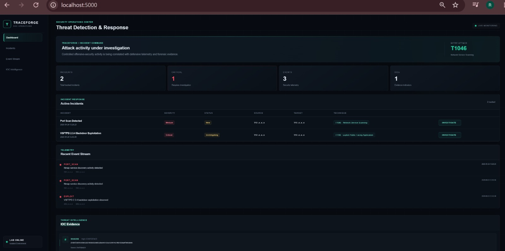

TRACEFORGE
Threat Detection & Response Platform

TRACEFORGE is a lightweight Security Operations Center (SOC) investigation platform built in a controlled cybersecurity laboratory.
It ingests security telemetry, detects selected attack patterns, creates incidents, maps activity to MITRE ATT&CK techniques, stores indicators of compromise, and presents investigation evidence through a SOC-style web dashboard.

Dashboard

Features
Security event ingestion through REST APIs
Automatic PORT_SCAN detection
Automatic incident creation
Incident severity and status tracking
Source and target IP correlation
MITRE ATT&CK technique mapping
IOC storage and investigation
Forensic event timeline
Incident investigation pages
SQLite persistence
SOC-style web dashboard
Health-check API
Public-safe IP masking for portfolio presentation
Technology Stack
ComponentTechnology
BackendPython / Flask
DatabaseSQLite
FrontendHTML / CSS / Jinja2
APIREST / JSON
Security FrameworkMITRE ATT&CK
Lab TargetMetasploitable2
EnvironmentUbuntu Linux
Architecture
Controlled Cybersecurity Lab
            |
            v
     Security Activity
            |
            v
     TRACEFORGE REST API
            |
            v
       Detection Rule
            |
            v
     Incident Creation
            |
            v
    MITRE ATT&CK Mapping
            |
            v
      SQLite Database
            |
            v
   SOC Investigation Dashboard
Lab Environment

TRACEFORGE was tested in an isolated and authorized cybersecurity laboratory.

Lab Roles
RoleDescription
AttackerKali Linux security testing host
TargetMetasploitable2 intentionally vulnerable host
PlatformUbuntu Linux
NetworkIsolated virtual lab

Private lab IP addresses are intentionally omitted from the public documentation.

Observed activity included:

Network service discovery
VSFTPD 2.3.4 backdoor exploitation
Root-level lab investigation
Suspicious executable analysis
File hash collection
Detection Workflow

TRACEFORGE automatically detects PORT_SCAN events submitted through its REST API.

Example Event
{
  "event_type": "PORT_SCAN",
  "source_ip": "<attacker-ip>",
  "target_ip": "<target-ip>",
  "message": "Nmap service discovery activity detected",
  "severity": "Medium"
}
Detection Pipeline
PORT_SCAN Event
      |
      v
Event Stored
      |
      v
Detection Rule Triggered
      |
      v
Incident Created
      |
      v
T1046 Assigned
      |
      v
SOC Investigation Dashboard

The resulting incident contains:

Title:      Port Scan Detected
Severity:   Medium
Status:     New
Technique:  T1046 - Network Service Scanning
MITRE ATT&CK Mapping
T1046  Network Service Scanning

Used for the TRACEFORGE network service discovery detection workflow.

T1190  Exploit Public-Facing Application

Used for the lab exploitation investigation involving the VSFTPD 2.3.4 backdoor scenario.

Incident Investigation

Each incident can be opened from the dashboard for deeper investigation.

The investigation view provides:

Incident metadata
Severity and status
Source and target correlation
MITRE ATT&CK technique
Security event evidence
IOC evidence
Investigation context
API Endpoints
MethodEndpointPurpose
GET/api/healthApplication health check
POST/api/eventsSubmit security telemetry
GET/api/eventsRetrieve security events
POST/api/iocsStore an IOC
GET/incident/<incident_id>Investigate an incident
Example API Request

A PORT_SCAN event can be submitted using:

curl -X POST http://127.0.0.1:5000/api/events \
  -H "Content-Type: application/json" \
  -d '{
    "event_type": "PORT_SCAN",
    "source_ip": "<attacker-ip>",
    "target_ip": "<target-ip>",
    "message": "Nmap service discovery activity detected",
    "severity": "Medium"
  }'
Health Check
curl http://127.0.0.1:5000/api/health

Example response:

{
  "status": "ok"
}
IOC Intelligence

TRACEFORGE stores indicators of compromise and forensic evidence associated with investigations.

Example IOC
Type:       SHA256
Confidence: High

d7d6f250767d5032d1703b65b30d52d6e947cb1e519974170b7d10a0f4056846

The hash was collected during analysis of a suspicious executable discovered in the controlled laboratory.

Forensic Artifact

The lab investigation included analysis of a suspicious executable discovered on the compromised test system.

Artifact Type: Suspicious Executable
Location:     /XwtTAjfwjUA

MD5:
0eb8e7e70158c3e9adb16ef54aa2dc63

SHA256:
d7d6f250767d5032d1703b65b30d52d6e947cb1e519974170b7d10a0f4056846
Database

TRACEFORGE uses SQLite for lightweight persistence.

Primary Tables
incidents

Stores detected security incidents, severity, status, source/target context, and MITRE ATT&CK mappings.

events

Stores incoming security telemetry and event metadata.

iocs

Stores indicators of compromise and associated forensic evidence.

Project Structure
traceforge/
 app.py
 README.md
 .gitignore
 templates/
    dashboard.html
    incident.html
 static/
     style.css

Runtime files such as the virtual environment, Python cache files, and local SQLite database are excluded through .gitignore.

Running TRACEFORGE

Clone the repository:

git clone https://github.com/Codewith-Rutuja/TRACEFORGE.git
cd TRACEFORGE

Create and activate a virtual environment:

python3 -m venv venv
source venv/bin/activate

Install Flask:

pip install flask

Start the application:

python3 app.py

The application will be available locally at:

http://127.0.0.1:5000
Portfolio Value

TRACEFORGE demonstrates practical security engineering skills across:

Python development
Flask web application development
REST API design
SQLite database design
Security event processing
Detection engineering
Incident response workflows
MITRE ATT&CK analysis
IOC handling
Forensic evidence collection
SOC dashboard development
Linux administration
Controlled penetration-testing lab analysis
Security Concepts Demonstrated

TRACEFORGE combines several practical blue-team concepts:

Telemetry
   |
   v
Detection Engineering
   |
   v
Incident Creation
   |
   v
MITRE ATT&CK Mapping
   |
   v
Evidence Collection
   |
   v
IOC Analysis
   |
   v
Investigation

The project demonstrates how security telemetry can move from raw events into an investigation workflow rather than remaining as isolated log entries.

Disclaimer

TRACEFORGE was developed and tested in an isolated, controlled cybersecurity laboratory.

All offensive-security activity referenced by this project was performed against intentionally vulnerable laboratory systems for authorized security research and defensive detection engineering.

Do not use the techniques demonstrated by the laboratory against systems without explicit authorization.

Author

Codewith-Rutuja

TRACEFORGE  Security Operations Center / Detection Engineering Project
